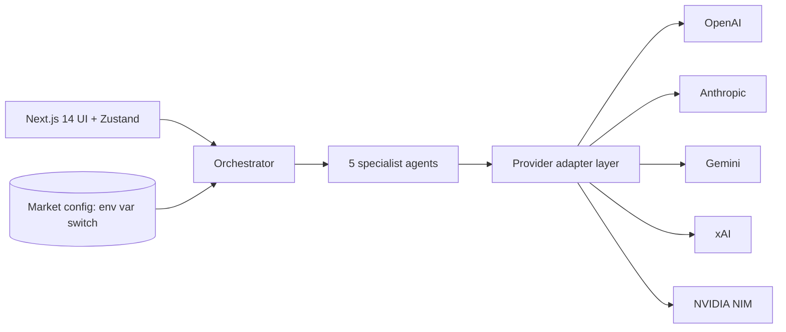
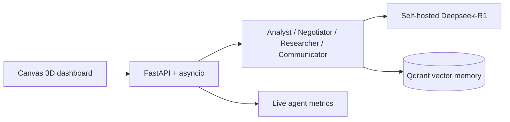

<div align="center">


[](https://github.com/a-nayem)


[](https://a-nayem.vercel.app)
[](https://linkedin.com/in/alifnayem-trisienautomence)
[](mailto:alifnayem39@gmail.com)
[](https://github.com/a-nayem)


</div>

<div align="center">


</div>

## `$ cat about.md`

AI systems architect and cybersecurity engineer directing prompt-engineered builds from architecture through production deployment. Founder of **Trisien Automence**, designing self-hosted, multi-agent infrastructure for clients across four countries with zero recurring SaaS cost and full data ownership. Extending core engineering into applied security as an active, self-directed specialization.

```bash
$ whoami --full
ROLE      AI Systems Architect / Cybersecurity Engineer
EXP       Founder @ Trisien Automence (2025-Present)
DOMAIN    Autonomous AI, Multi-Agent Systems, Applied Offensive Security
STACK     Python, TypeScript, FastAPI, Docker, n8n, Kali Linux
CERT      CDA (Coursera, 2023)
OPEN_TO   Freelance contracts + Full-time roles
```

## `$ ./dual_boot.sh`

*Two boots, one operator. Left is what I build with. Right is what I'm building toward.*

<div align="center">
<table>
<tr>
<td width="50%"></td>
<td width="50%"></td>
</tr>
</table>
</div>

## `$ ls ./projects --verbose`

*All projects below are actively evolving - features ship whenever they come to mind, not on a fixed release schedule.*

<details open>
<summary><strong>Portfolio</strong> - sim-racing HUD personal site</summary>
<br>

| | |
|---|---|
| **Stack** | Next.js 15, React 19, TypeScript, Tailwind 4, three.js, Lenis |
| **Scale** | 6 pages as 6 gears, 8 projects, a wireframe reactor core that separates into 4 skill layers, a scripted ELUSIVE terminal with Arch style commands |
| **Impact** | Hand built with no UI kit, black and red HUD design that shows the work instead of describing it |

[](https://a-nayem.vercel.app)

</details>

<details>
<summary><strong>Trisien Automence Agency Site</strong> - public face of the agency</summary>
<br>

| | |
|---|---|
| **Stack** | Next.js, TypeScript, Canvas 2D, Tailwind, Vercel |
| **Scale** | OrbitalMesh hero written from scratch on Canvas 2D, 6 agent cards orbiting a gyroscope ring sphere |
| **Impact** | Copy tailored to Canada, Germany, Australia and the Netherlands, built to earn trust in under 10 seconds |

[](https://trisien-automence.vercel.app)

</details>

<details open>
<summary><strong>Trisien OS</strong> - provider-agnostic multi-agent orchestration layer</summary>
<br>

| | |
|---|---|
| **Stack** | Next.js 14, TypeScript, Zustand, OpenAI / Anthropic / Gemini / xAI / NIM |
| **Scale** | 6 LLM providers unified, 5 specialist agents, 3,595 lines of production TypeScript, zero-error build |
| **Impact** | Config-driven deployment across 4 international markets (Canada, Germany, Australia, Netherlands) with zero duplicated logic, single environment-variable market switch |

[](https://trisien-automence.vercel.app)

</details>

<details>
<summary><strong>Trisien Vault</strong> - self-hosted agentic second brain</summary>
<br>

| | |
|---|---|
| **Stack** | Python, FastAPI, asyncio, self-hosted Deepseek-R1, Qdrant, Canvas 3D |
| **Scale** | 4-agent system (Analyst, Negotiator, Researcher, Communicator), 342-node 3D knowledge graph |
| **Impact** | Self-hosted vector memory with zero per-query cloud cost, live agent metrics dashboard |

[](https://trisien-vault.vercel.app)

</details>

<details>
<summary><strong>Trisien CRM</strong> - self-hosted agentic CRM</summary>
<br>

| | |
|---|---|
| **Stack** | Next.js, TypeScript, Supabase, PostgreSQL, n8n |
| **Scale** | 4-stage Kanban pipeline, AI lead scoring, multi-market support (CA, DE, AU, NL) |
| **Impact** | Replaces ~$200/year in SaaS spend, cut lead processing time by ~90%, sub-500ms real-time sync |

[](https://trisien-crm.vercel.app)

</details>

<details>
<summary><strong>Multiagent-OS (SecondBrain)</strong> - client-side AI knowledge system</summary>
<br>

| | |
|---|---|
| **Stack** | Next.js, TypeScript, Three.js, Gemini 2.5 Flash / OpenRouter |
| **Scale** | 5 agent roles (Researcher, Summarizer, Connector, Digest, Custom), 10 free-tier models unified, 1,645 lines of verified TypeScript |
| **Impact** | Fully client-side, zero backend, zero hosting cost, zero-error build |

[](https://multi-agent-daily.vercel.app) [](https://github.com/a-nayem/multi-agent-daily) [](https://github.com/a-nayem/multi-agent-daily/actions/workflows/ci.yml)

</details>

<details>
<summary><strong>ELUSIVE</strong> - local agentic system (personal, private)</summary>
<br>

| | |
|---|---|
| **Stack** | Fedora, local LLM runtime, Ollama / Groq / NVIDIA NIM / Gemini / Anthropic |
| **Scale** | v2, 55 tools, native function calling, three-layer sync with offline queuing |
| **Impact** | Fully local, multi-provider routing with no single point of vendor lock-in |

*Personal-only - no public deployment or repo. Currently the most active project on this list.*

</details>

<details>
<summary><strong>Quizzen</strong> (formerly Mind-Forge) - offline Android quiz app</summary>
<br>

| | |
|---|---|
| **Stack** | Apache Cordova, JavaScript, Android, LocalStorage |
| **Scale** | 6 domains, 400 questions each across 4 difficulty tiers, XP and level system |
| **Impact** | Fully offline, 30-minute daily lock to enforce intentional practice |

[](https://github.com/a-nayem/Mind-Forge)

</details>

<details>
<summary><strong>Oblivion</strong> - self-built Obsidian clone</summary>
<br>

| | |
|---|---|
| **Stack** | Next.js, React |
| **Scale** | Markdown-based notes with a graph view for linked-note visualization |
| **Impact** | Live web app, self-hosted, own note-taking system with zero dependency on Obsidian |

[](https://oblivion-nu.vercel.app/login)

</details>

<details>
<summary><strong>NFC Cards</strong> - three small web experiences delivered as physical cards</summary>
<br>

| | |
|---|---|
| **Stack** | Next.js, TypeScript, NFC, Vercel |
| **Scale** | Elusive: Story of Safety (24 feelings, each tied to a story, a mood and a letter), Sketch the Air Muse (an AI muse that turns a mood and a scene into a drawing idea), Mood Dice (a roll that gives a small positive action for the day) |
| **Impact** | Each one is tapped in from an NFC card with a custom sticker, so the experience lives outside the screen |

[](https://elusive-story-of-safety.vercel.app) [](https://sketch-the-air.vercel.app) [](https://mood-dice-rouge.vercel.app)

</details>

## `$ cat ./architecture.md`

*High-level data flow for the two core systems.*

**Trisien OS** - one orchestrator, many providers, market behavior set by config.



**Trisien Vault** - self-hosted agents with local inference and vector memory.



## `$ ls ./packages`

*Repeated logic from the projects above, being pulled out into standalone packages and templates.*

| Component | Source | Purpose | Status |
|---|---|---|---|
| `llm-provider-adapter` | Trisien OS | Single interface across OpenAI, Anthropic, Gemini, xAI and NIM | Planned |
| `market-config` | Trisien OS / CRM | Env-var market switch with zero duplicated logic | Planned |
| `n8n-templates` | Trisien CRM | Importable lead scoring and pipeline workflows | Planned |
| `webhook-handlers` | Trisien CRM | Validated event routing for automation pipelines | Planned |

## `$ ./analytics.sh --github`

<!--
  Stats + top-langs previously used github-readme-stats.vercel.app, whose
  shared public instance has an open, unresolved outage (503
  DEPLOYMENT_PAUSED) plus chronic rate-limiting - see
  anuraghazra/github-readme-stats#4737. Replaced with stats-static.svg: a
  one-time render built from real api.github.com data, committed directly
  to this repo. No workflow, no token, no live service dependency - it just
  won't update itself. Regenerate manually (or ask Claude) every so often
  if the numbers drift.
-->

<div align="center">


</div>

## `$ ./contribution_snake.sh --run`

<!--
  REQUIRES: .github/workflows/snake.yml in this repo (a-nayem/a-nayem),
  which generates the "output" branch this SVG is pulled from. Without that
  workflow having run at least once, this image is a permanent 404. See
  snake.yml provided alongside this README - commit it, run it once manually
  via Actions > workflow_dispatch, confirm the "output" branch appears.
-->

<div align="center">


</div>

## `$ cat ./current_focus.yaml`

<div align="center">


</div>

## `$ ./connect.sh`

<div align="center">

[](https://a-nayem.vercel.app)
[](https://trisien-automence.vercel.app)
[](https://cal.com/alifnayem-j98vjt)
[](https://linkedin.com/in/alifnayem-trisienautomence)
[](https://instagram.com/_a.nayem_)
[](mailto:alifnayem39@gmail.com)

*"I don't just build tools, I build systems that think for themselves."*

</div>


